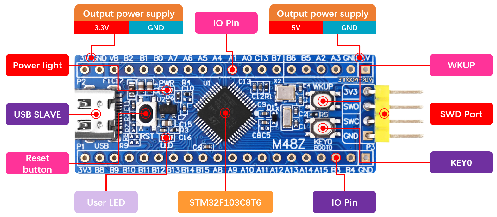

# ALIENTEK STM32F103 Mini Board User Guide

## 1 Repository overview

The file structure of the data disk is as follows:

| Root directory | Describe                                                     |
| -------------- | ------------------------------------------------------------ |
| 1_docs         | Mini Board related documentation,includes schematic diagrams, data sheets, pictures of each example configuration, pin elicitation diagrams, and pin assignment tables. |
| 2_tools        | Development tools. Such as Flash download software, USB virtual serial port driver, and serial port terminal, etc |
| examples       | Explains how to use STM32CubeIDE and 33 examples of different peripherals. |
| libraries      | HAL library for STM32F1. |

## 2 Board Resources

This manual aims to introduce the **hardware and software resources** of the M48Z-M3 Mini Board, including the introduction of chip resources, the introduction of experimental platform hardware resources, and the supporting resource use guide. By studying this manual, the reader will have a comprehensive understanding of the resources of the M48Z-M3 Mini Board, which will be very helpful for subsequent program design.

It is intended to provide readers with a comprehensive introduction to the M48Z-M3 Mini Board resources. It is highly recommended that you read this manual before learning the examples!

### 2.1 Hardware Description

M48Z-M3 Mini Board selects **STM32F103C8T6** as MCU, the chip integrates FPU instructions, It has 20 Kbytes of SRAM, 64 or 128 Kbytes of Flash memory, three 16-bit timers, 7-channel DMA controller, two SPI, three USART/UART, one CAN, one 12-bit ADC, one RTC (with calendar function) and 37 general IO ports.

+ **USB interface**: this interface can not only be used as a USB slave communication interface, but also has a power supply function, which can supply power for the smallest system board. USB_Slave can be used to connect the computer to realize the USB virtual serial port experiment.
+ **SWD debug port**: used for simulation debugging, downloading code, etc.;
+ **Reset button**: used to reset the Mini Board

### 2.2 Introduction to Software Resources

There are up to **33** examples provided. Before learning each example, carefully read the **README.md**, which includes a brief introduction to the example function, hardware hookup, STM32CubeIDE configuration instructions, and running phenomena. Here are all the examples.

| Num                  | Example Name                      | Num  | Example Name                                  		|
| -------------------- | --------------------------------- | ---- | ---------------------- 								|
| 01                   | 01_LED                            | 12   | 12_RTC 												|
| 02                   | 02_KEY                            | 13_1 | 13_1_LowPower_PVD                                   |
| 03                   | 03_EXTI                           | 13_2 | 13_2_LowPower_Sleep                                 |
| 04                   | 04_UART                           | 13_3 | 13_3_LowPower_Stop                                  |
| 05                   | 05_IWDG                           | 13_4 | 13_4_LowPower_Standby                               |
| 06                   | 06_WWDG                           | 14   | 14_DMA                                              |
| 07                   | 07_BTIM                           | 15_1 | 15_1_ADC_Single_Channel                             |
| 08_1                 | 08_1_GTIM_Interrupt               | 15_2 | 15_2_ADC_DMA_Single_Channel                         |
| 08_2                 | 08_2_GTIM_PWM                     | 15_3 | 15_3_ADC_DMA_Multi_Channel                          |
| 08_3                 | 08_3_GTIM_Capture                 | 16   | 16_ADC_Temperature                                  |
| 08_4                 | 08_4_GTIM_Count                   | 17   | 17_FLASH_EEPROM                                  	|                     																	
| 09_1                 | 09_1_ATIM_NPWM                    | 18   | 18_MALLOC      										|
| 09_2                 | 09_2_ATIM_Compare                 | 19_1 | 19_1_IAP_Bootloader                                 |
| 09_3                 | 09_3_ATIM_CPLM_PWM                | 19_2 | 19_2_KEY_FLASH_APP                                  |
| 09_4                 | 09_4_ATIM_PWM_IN                  | 20   | 20_USB_VSP                                          |
| 10                   | 10_TFTLCD_MCU            		   | 21   | FreeRTOS_Demo                                    	|                                         
| 11                   | 11_USMART         	               | 22   | f103_test      									    |
     						                                            												                                                                                       
														   																
## 3 How to use STM32CubeIDE
If you have not set up **STM32CubeIDE** or can't use it, you will need to do so following the [steps outlined in this tutorial](./1_docs/STM32CubeIDE_Usage_Guide.md).

## 4 Accessories
When using the MIni Board, you can use the following accessories.
 
| LCD module         | Dap Debugger   | USB to Serial Port module  | Digital Oscilloscope
| ------------------ | ----------------|---------------------------------------|------------------------------------------------ |
|      |         |      |  