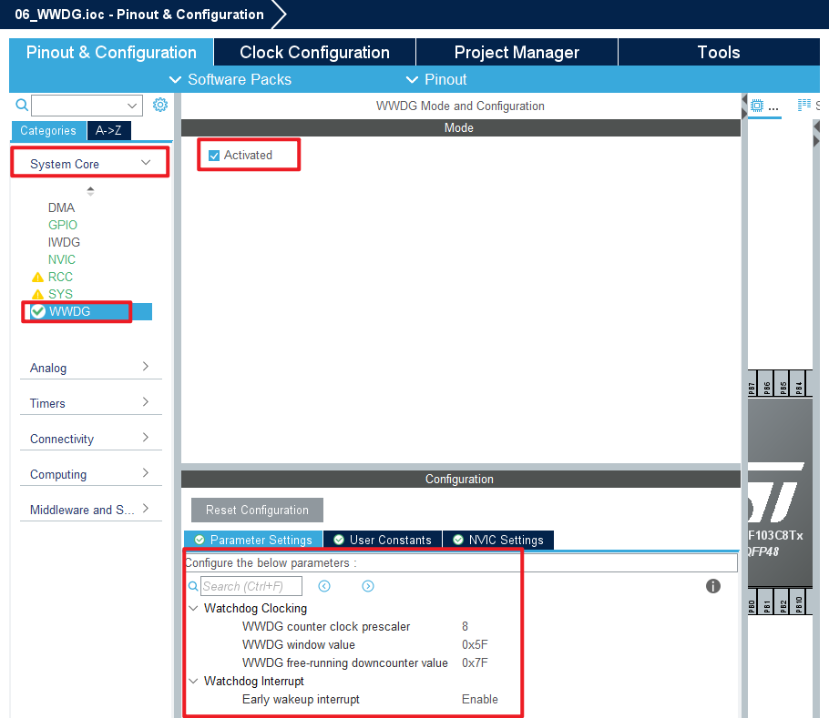
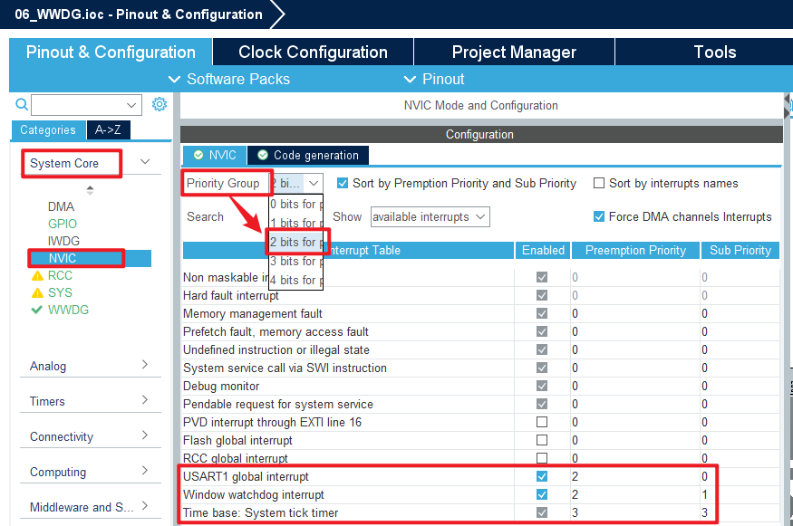

## WWDG example<a name="catalogue"></a>

### 1 Brief
The function of this program is to let the LED light for 300 milliseconds and then turn off, then turn on WWDG and enter the dead loop waiting for the interruption of wwdg.In the WWDG interrupt service function, the dog is fed and the serial port outputs a ``wwdg success`` message.
### 2 Hardware Hookup
The hardware resources used in this experiment are:
+ LED - PA8
+ USART1 - PA9\PA10
+ WWDG

The WWDG used in this experiment is the on-chip resource of STM32F103, so there is no corresponding connection schematic diagram.

### 3 STM32CubeIDE Configuration


Let's copy the project from **04_UART** and name both the project and the.ioc file **06_WWDG**. Next we start the WWDG configuration by double-clicking the **06_wwdg.ioc** file.

First, click **System Core > WWDG**, and the configuration is as follows:



The configuration of the NVIC is shown below:



Click **File > Save**, and you will be asked to generate code.Click **Yes**.

##### code
###### wwdg.c
We added an interrupt callback function to the initialization code, as follows:
```c#
void HAL_WWDG_EarlyWakeupCallback(WWDG_HandleTypeDef *hwwdg)
{
    HAL_WWDG_Refresh(hwwdg);      /* Update the window watchdog value. */
    printf("wwdg success\r\n");   /* Feeding the dog successfully. */
}
```
From the above code, in the interrupt service function, we perform a dog feed operation on WWDG and print a message from the serial port indicating that the dog was fed successfully.

###### main.c
The main.c code of this experiment lets the LCD light up for 300 milliseconds, and turns off the LED in the while loop as follows:
```c#
int main(void)
{
  /* USER CODE BEGIN 1 */

  /* USER CODE END 1 */

  /* MCU Configuration--------------------------------------------------------*/

  /* Reset of all peripherals, Initializes the Flash interface and the Systick. */
  HAL_Init();

  /* USER CODE BEGIN Init */

  /* USER CODE END Init */

  /* Configure the system clock */
  SystemClock_Config();

  /* USER CODE BEGIN SysInit */

  /* USER CODE END SysInit */

  /* Initialize all configured peripherals */
  MX_GPIO_Init();
  MX_USART1_UART_Init();
  MX_WWDG_Init();
  /* USER CODE BEGIN 2 */
  LED(0);                    /* turn on LED */
  HAL_Delay(300);            /* delay 300ms */

  /* USER CODE END 2 */

  /* Infinite loop */
  /* USER CODE BEGIN WHILE */
  while (1)
  {
    LED(1);                 /* turn off LED */
    /* USER CODE END WHILE */

    /* USER CODE BEGIN 3 */
  }
  /* USER CODE END 3 */
}
```

### 4 Running
#### 4.1 Compile & Download
After the compilation is complete, connect the DAP and the minimal system board, and then connect to the computer together to download the program to the development board.
#### 4.2 Phenomenon
Press the reset button to restart the development board, open the serial debugging assistant will print the experiment information, indicating that the program has been downloaded successfully.Observe that the LED on the development board will light up and turn off once, and the serial port host computer **ATK-XCOM** can see the continuous print ``wwdg succes``, indicating that the WWDG feeding dog has been normally executed.


[jump to tittle](#catalogue)

