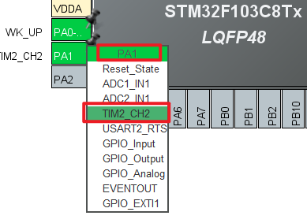
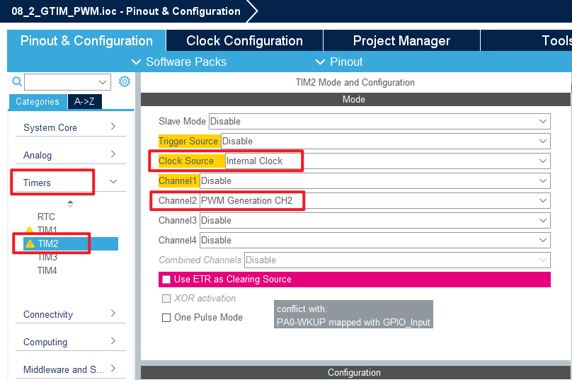
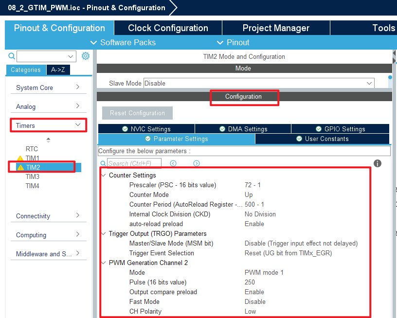

## General-purpose timer PWM output example<a name="catalogue"></a>


### 1 Brief
The function of this program is to use the  general-purpose timers 2 channel 2 multiplexing pin PA1 output PWM, to achieve LED from dark to light, and then from light to dark, in turn cycle.
### 2 Hardware Hookup
The hardware resources used in this experiment are:
+ LED - PA8
+ USART1 - PA9\PA10
+ TIM2 - channel2(PA1)

The TIM2 used in this experiment is the on-chip resource of STM32F103, so there is no corresponding connection schematic diagram.

### 3 STM32CubeIDE Configuration


Let's copy the project from **04_UART** and name both the project and the.ioc file **08_2_GTIM_PWM**. Next we start the GTIM configuration by double-clicking the **08_2_GTIM_PWM.ioc** file.

First, we multiplexed the PA1 pin into TIM2_CH2, as shown below.



Click **Timers->TIM3** and configure as shown in the following figure.



The red box above indicates that the internal clock is selected and the PWM waveform is generated by channel 2. The other options are left at the default settings.

The **Parameter Settings** are as follows.



Click **File > Save**, and you will be asked to generate code.Click **Yes**.

##### code
We add some code to the tim.c file's initialization function ``MX_TIM2_Init``, as follows:
###### tim.c
```c#
  /* USER CODE BEGIN TIM2_Init 2 */
  HAL_TIM_PWM_Start(&htim2, TIM_CHANNEL_2);  /* Open the corresponding PWM channel */
  /* USER CODE END TIM2_Init 2 */
```
The above function ``HAL_TIM_PWM_Start`` is used to enable TIM2 and enable the TIM2_CH2 output of the PWM channel.

###### main.c
The comparison value of TIM2_CH2 is constantly changed in the while loop of the main function, the specific code is as follows.
```c#
int main(void)
{
  /* USER CODE BEGIN 1 */
  uint8_t dir = 1;
  uint16_t ledrpwmval = 0;
  /* USER CODE END 1 */

  /* MCU Configuration--------------------------------------------------------*/

  /* Reset of all peripherals, Initializes the Flash interface and the Systick. */
  HAL_Init();

  /* USER CODE BEGIN Init */

  /* USER CODE END Init */

  /* Configure the system clock */
  SystemClock_Config();

  /* USER CODE BEGIN SysInit */

  /* USER CODE END SysInit */

  /* Initialize all configured peripherals */
  MX_GPIO_Init();
  MX_USART1_UART_Init();
  MX_TIM2_Init();
  /* USER CODE BEGIN 2 */

  /* USER CODE END 2 */

  /* Infinite loop */
  /* USER CODE BEGIN WHILE */
  while (1)
  {
    HAL_Delay(10);    /* delay 10ms */

    if (dir == 1)
    {
       ledrpwmval++;  /* dir==1,ledrpwmval increments */
    }
    else
    {
       ledrpwmval--;  /* dir==0,ledrpwmval decrements */
    }

    if (ledrpwmval > 300)
    {
       dir = 0;       /* After ledrpwmval reaches 300, the direction is decreasing */
    }
    if (ledrpwmval == 0)
    {
       dir = 1;        /* After ledrpwmval decrements to 0, the direction is changed to increasing */
    }

    /* Modify the comparison value to control the duty cycle */
     __HAL_TIM_SET_COMPARE(&htim2, TIM_CHANNEL_2, ledrpwmval);
    /* USER CODE END WHILE */

    /* USER CODE BEGIN 3 */
  } 
  /* USER CODE END 3 */
}
```
The above program changes the comparison value of TIM2_CH2 in the loop to achieve the purpose of changing the PWM duty cycle. And because the PWM is output by the PA8 pin, the PA1 pin is connected to the LED, so the brightness of the LED will change accordingly, so as to achieve the effect of the breathing lamp.


### 4 Running
#### 4.1 Compile & Download
After the compilation is complete, connect the DAP and the minimal system board, and then connect to the computer together to download the program to the development board.
#### 4.2 Phenomenon
Press the reset button to restart the development board, open the serial port host computer ATK-XCOM, and you can see the experimental prompt message, indicating that the code has been successfully downloaded.Observe the LED on the development board to gradually change from dark to bright, and then from light to dark.

[jump to tittle](#catalogue)

