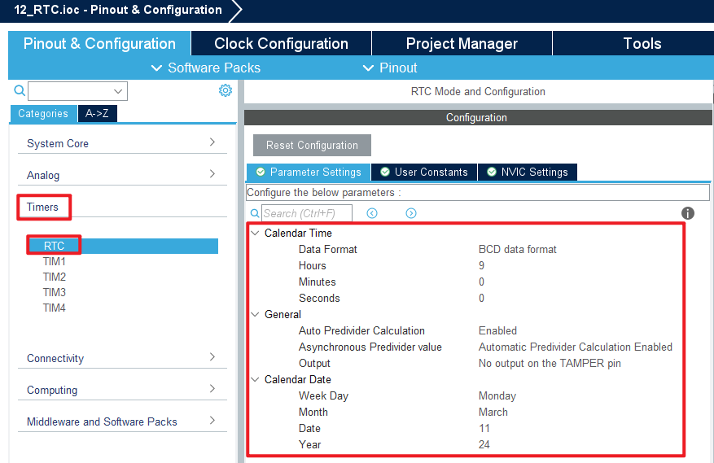

## RTC example<a name="catalogue"></a>

### 1 Brief
The function of this code is to generate an RTC wake-up interrupt every second.
### 2 Hardware Hookup
The hardware resources used in this experiment are:
+ LED - PA8
+ USART1 - PA9\PA10
+ RTC
+ ALIENTEK 1.3-inch TFTLCD module(MCU screen only, SPI interface driver)

The RTC used in this experiment is the on-chip resource of STM32F103, so there is no corresponding connection schematic.

### 3 STM32CubeIDE Configuration


Let's copy the project from  **10_TFTLCD_MCU** and name both the project and the.ioc file **12_RTC**. Next we start the RTC configuration by double-clicking the **12_RTC.ioc** file.

First click **Clock Configuration** and set it as shown below.


Open **Timers > RTC** as shown below.




Open **NVIC** configuration as shown below.


Click **File > Save**, and you will be asked to generate code.Click **Yes**.

##### code
###### rtc.c
We added a lot of code to rtc.c, so you can open the source code to have a look, but here are the important ones:
```c#
uint8_t rtc_set_time(uint16_t syear, uint8_t smon, uint8_t sday, uint8_t hour, uint8_t min, uint8_t sec)
{
    uint32_t seccount = 0;

    seccount = rtc_date2sec(syear, smon, sday, hour, min, sec); /* Convert year, month, day, hour, and second into total seconds */

    __HAL_RCC_PWR_CLK_ENABLE(); /* Enable PWR clock */
    __HAL_RCC_BKP_CLK_ENABLE(); /* Enable BKP clock */
    HAL_PWR_EnableBkUpAccess(); /* Disable write protection for BKP */
    /* The above three steps are a must! */

    RTC->CRL |= 1 << 4;         /* Enable configuration */

    RTC->CNTL = seccount & 0xffff;
    RTC->CNTH = seccount >> 16;

    RTC->CRL &= ~(1 << 4);      /* Configuration update */

    while (!__HAL_RTC_ALARM_GET_FLAG(&hrtc, RTC_FLAG_RTOFF));       /* Wait for the RTC register operation to complete, that is, wait for RTOFF == 1 */

    return 0;
}
```
The preceding function is used to set a time.We input a time that will be used as a baseline for subsequent calculations.

```c#
rtc_get_time(void)
{
    static uint16_t daycnt = 0;
    uint32_t seccount = 0;
    uint32_t temp = 0;
    uint16_t temp1 = 0;
    const uint8_t month_table[12] = {31, 28, 31, 30, 31, 30, 31, 31, 30, 31, 30, 31}; /* A table of months and dates for ordinary years */

    seccount = RTC->CNTH;       /* Get the value in the counter (seconds) */
    seccount <<= 16;
    seccount += RTC->CNTL;

    temp = seccount / 86400;    /* Get the number of days (in seconds) */

    if (daycnt != temp)         /* More than a day */
    {
        daycnt = temp;
        temp1 = 1970;           /* Since 1970 */

        while (temp >= 365)
        {
            if (rtc_is_leap_year(temp1)) /* It is a leap year */
            {
                if (temp >= 366)
                {
                    temp -= 366; /* The number of seconds in leap years */
                }
                else
                {
                    break;
                }
            }
            else
            {
                temp -= 365;    /* non-leap year */
            }

            temp1++;
        }

        calendar.year = temp1;  /* Acquired year */
        temp1 = 0;

        while (temp >= 28)      /* More than a mounth */
        {
            if (rtc_is_leap_year(calendar.year) && temp1 == 1) /* It is not a leap year/February */
            {
                if (temp >= 29)
                {
                    temp -= 29; /* The number of seconds in leap years */
                }
                else
                {
                    break;
                }
            }
            else
            {
                if (temp >= month_table[temp1])
                {
                    temp -= month_table[temp1]; /* non-leap year */
                }
                else
                {
                    break;
                }
            }

            temp1++;
        }

        calendar.month = temp1 + 1; /* Acquired month */
        calendar.date = temp + 1;   /* Get date */
    }

    temp = seccount % 86400;                                                    /* Get seconds */
    calendar.hour = temp / 3600;                                                /* Hour */
    calendar.min = (temp % 3600) / 60;                                          /* Minute */
    calendar.sec = (temp % 3600) % 60;                                          /* Second */
    calendar.week = rtc_get_week(calendar.year, calendar.month, calendar.date); /* Acquisition week */
}

uint8_t rtc_get_week(uint16_t year, uint8_t month, uint8_t day)
{
    uint8_t week = 0;

    if (month < 3)
    {
        month += 12;
        --year;
    }

    week = (day + 1 + 2 * month + 3 * (month + 1) / 5 + year + (year >> 2) - year / 100 + year / 400) % 7;
    return week;
}

```
The above two functions to obtain and set the RTC time and date are simple packages of the RTC driver in STM32.

###### main.c
In the while loop of the main function, we will read the RTC time and date every 100 milliseconds, as follows:
```c#
int main(void)
{
  /* USER CODE BEGIN 1 */
  uint8_t tbuf[40];
  uint8_t t = 0;
  /* USER CODE END 1 */

  /* MCU Configuration--------------------------------------------------------*/

  /* Reset of all peripherals, Initializes the Flash interface and the Systick. */
  HAL_Init();

  /* USER CODE BEGIN Init */

  /* USER CODE END Init */

  /* Configure the system clock */
  SystemClock_Config();

  /* USER CODE BEGIN SysInit */

  /* USER CODE END SysInit */

  /* Initialize all configured peripherals */
  MX_GPIO_Init();
  MX_USART1_UART_Init();
  MX_SPI1_Init();
  MX_RTC_Init();
  /* USER CODE BEGIN 2 */
  stm32f103c8t6_show_mesg();
  lcd_init();                        	/* Initialize LCD */
  lcd_show_string(30, 50, 200, 16, 16, "STM32F103C8T6", RED);
  lcd_show_string(30, 70, 200, 16, 16, "RTC TEST", RED);
  lcd_show_string(30, 90, 200, 16, 16, "ATOM@ALIENTEK", RED);
  /* USER CODE END 2 */

  /* Infinite loop */
  /* USER CODE BEGIN WHILE */
  while (1)
  {
    t++;

    if ((t % 10) == 0)       /* The display data is updated every 100ms */
    {
		rtc_get_time();
        sprintf((char *)tbuf, "Time:%02d:%02d:%02d", calendar.hour, calendar.min, calendar.sec);
        printf("Time:%02d:%02d:%02d\r\n", calendar.hour, calendar.min, calendar.sec);
        lcd_show_string(0, 80, 210, 16, 16, (char *)tbuf,BLUE);
        sprintf((char *)tbuf, "Date:%04d-%02d-%02d", calendar.year, calendar.month, calendar.date);
        printf("Date:%02d-%02d-%02d\r\n",  calendar.year,  calendar.month,  calendar.date);
        lcd_show_string(0, 100, 210, 16, 16, (char *)tbuf,BLUE);
        sprintf((char *)tbuf, "Week:%s", weekdays[calendar.week]);
        lcd_show_string(0, 120, 210, 16, 16, (char *)tbuf,BLUE);
    }

	if ((t % 20) == 0)
	{
		LED_TOGGLE();              	/* Every 200ms, flip the LED */
	}

    HAL_Delay(10);
    /* USER CODE END WHILE */

    /* USER CODE BEGIN 3 */
  }
  /* USER CODE END 3 */
}
```
The driving LED blinks in the while loop to indicate that the experiment is in progress.


### Operation
#### Compile & Download
After the compilation is complete, connect the DAP and the Mini Board, and then connect to the computer together to download the program to the Mini Board.
#### Experimental phenomenon
Press the reset button to restart the Mini Board, observe the LED flashing on the Mini Board, open the serial port and the host computer **ATK-XCOM** can see the prompt information of the experiment, indicating that the code download is successful. We use the serial port to debug the RTC phenomenon as shown below:


[jump to tittle](#catalogue)