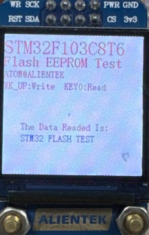

## FLASH_EEPROM example<a name="catalogue"></a>


### 1 Brief
The function of this program is to press the WKUP and KEY0 keys, respectively, the Flash data write and read operations, read the data will be displayed to the serial port host computer.
### 2 Hardware Hookup
The hardware resources used in this experiment are:
+ LED - PA8
+ USART1 - PA9\PA10
+ KEY - WKUP(PA0)
+ KEY - KEY0(PC13) 

The FLASH used in this experiment is an on-chip resource of STM32F103, so there is no corresponding connection schematic.

### 3 STM32CubeIDE Configuration


We copy the **11_USMART** project and name both the project and the.ioc file **17_FLASH_EEPROM**.
This experiment does not need to be configured on STM32CubeIDE, so after copying the project, you can directly add the user driver code.

##### code
###### stmflash.h
In Flash driver, Flash related definitions and Flash sector start address definitions.
```c#
/* FLASH start address */
#define STM32_FLASH_BASE        0x08000000                            /* STM32 FLASH start address */
#define STM32_FLASH_SIZE        0x20000                               /* Total STM32 FLASH size */
#define FLASH_WAITETIME         50000                                 /* Flash waits for a timeout */
```
**STM32_FLASH_BASE** is the start address of the FLASH.
**STM32_FLASH_SIZE** is the total FLASH size.
The above two macro definitions are fixed along with the chip.

##### stmflash.c
```c#
void stmflash_read(uint32_t raddr, uint32_t *pbuf, uint32_t length)
{
    uint32_t  i;

    for (i = 0; i < length; i++)
    {
        pbuf[i] = stmflash_read_word(raddr);/* Read 2 bytes */
        raddr += 2;                         /* Offset by 2 bytes */
    }
}
```
The above function is the FLASH driver in the read function, the function is mainly to read the value of the address, used to write function call check, to ensure that the success of the write.
```c#
uint16_t g_flashbuf[STM32_SECTOR_SIZE / 2]; /* 最多是2K字节 */
void stmflash_write(uint32_t waddr, uint16_t *pbuf, uint16_t length)
{
    uint32_t secpos;                                                /* Sector address */
    uint16_t secoff;                                                /* Intra-sector offset address (16-bit word calculation) */
    uint16_t secremain;                                             /* Remaining address in sector (16-bit word count) */
    uint16_t i;
    uint32_t offaddr;                                               /* Remove the address after 0X08000000 */
    FLASH_EraseInitTypeDef flash_eraseop;
    uint32_t erase_addr;                                            /* Erase error. This value is the address of the sector where the error occurred */

    if (waddr < STM32_FLASH_BASE || (waddr >= (STM32_FLASH_BASE + 1024 * STM32_FLASH_SIZE)))
    {
        return;                                                     /* illegal address */
    }

    HAL_FLASH_Unlock();                                             /* FLASH unlock */

    offaddr = waddr - STM32_FLASH_BASE;                             /* Actual offset address */
    secpos = offaddr / STM32_SECTOR_SIZE;                           /* Sector address  0~127 for STM32F103C8T6 */
    secoff = (offaddr % STM32_SECTOR_SIZE) / 2;                     /* Offset within a sector (2 bytes is the base unit.) */
    secremain = STM32_SECTOR_SIZE / 2 - secoff;                     /* Size of the remaining sector space */
    if (length <= secremain)
    {
        secremain = length;                                         /* Not greater than the sector range */
    }

    while (1)
    {
        stmflash_read(secpos * STM32_SECTOR_SIZE + STM32_FLASH_BASE, g_flashbuf, STM32_SECTOR_SIZE / 2);    /* Read the contents of the entire sector */
        for (i = 0; i < secremain; i++)                                                                     /* parity data */
        {
            if (g_flashbuf[secoff + i] != 0XFFFF)
            {
                break;                                              /* Need to erase */
            }
        }
        if (i < secremain)                                          /* Need to erase */
        { 
            flash_eraseop.TypeErase = FLASH_TYPEERASE_PAGES;        /* Select erase */
            flash_eraseop.Banks = FLASH_BANK_1;
            flash_eraseop.NbPages = 1;
            flash_eraseop.PageAddress = secpos * STM32_SECTOR_SIZE + STM32_FLASH_BASE;  /* Sectors to erase */
            HAL_FLASHEx_Erase( &flash_eraseop, &erase_addr);

            for (i = 0; i < secremain; i++)                         /* Copy */
            {
                g_flashbuf[i + secoff] = pbuf[i];
            }
            stmflash_write_nocheck(secpos * STM32_SECTOR_SIZE + STM32_FLASH_BASE, g_flashbuf, STM32_SECTOR_SIZE / 2); /* Writes to the entire sector */
        }
        else
        {
            stmflash_write_nocheck(waddr, pbuf, secremain);         /* Write what has been erased, directly write to the rest of the sector. */
        }
        if (length == secremain)
        {
            break;                                                  /* Finish writing */
        }
        else                                                        /* Write unfinished */
        {
            secpos++;                                               /* The sector address is increased by 1 */
            secoff = 0;                                             /* The offset position is 0 */
            pbuf += secremain;                                      /* Pointer offset */
            waddr += secremain * 2;                                 /* Write address offset (16-bit data address, *2 required) */
            length -= secremain;                                    /* The number of bytes (16 bits) decreases */
            if (length > (STM32_SECTOR_SIZE / 2))
            {
                secremain = STM32_SECTOR_SIZE / 2;                  /* The next sector has not yet been written */
            }
            else
            {
                secremain = length;                                 /* The next sector can be written */
            }
        }
    }

    HAL_FLASH_Lock();                                               /* lock */
}
```
The preceding function writes data of a specified length at a specified address.
A few things to note:
+ The write address must be outside the user code area
+ Start address (This address must be a multiple of 2!! Otherwise, write error!)
+ The number of half words (16 bits) to be written

This is due to the nature of the FLASH of STM32F1, where each write must be 128 bits wide, which is 16 bytes.

###### usmart_config.c
The **usmart_nametab** array is modified in this file to facilitate the call validation of the relevant functions as follows:
```c#
struct _m_usmart_nametab usmart_nametab[] =
{
#if USMART_USE_WRFUNS == 1      /* If read and write operations are enabled */
    (void *)read_addr, "uint32_t read_addr(uint32_t addr)",
    (void *)write_addr, "void write_addr(uint32_t addr,uint32_t val)",
#endif

	(void *)stmflash_read_halfword, "uint16_t stmflash_read_halfword(uint32_t faddr)",
	(void *)test_write, "void test_write(uint32_t waddr, uint16_t wdata)",
};
```
The related functions of stmflash are added to USMART, so that the value written or read by FLASH can be set directly through the serial port.
###### main.c
Here's the main function.
```c#
int main(void)
{
  /* USER CODE BEGIN 1 */

    uint8_t key = 0;
    uint8_t i = 0;
    uint8_t datatemp[SIZE];

  /* USER CODE END 1 */

  /* MCU Configuration--------------------------------------------------------*/

  /* Reset of all peripherals, Initializes the Flash interface and the Systick. */
  HAL_Init();

  /* USER CODE BEGIN Init */

  /* USER CODE END Init */

  /* Configure the system clock */
  SystemClock_Config();

  /* USER CODE BEGIN SysInit */

  /* USER CODE END SysInit */

  /* Initialize all configured peripherals */
  MX_GPIO_Init();
  MX_USART1_UART_Init();
  MX_SPI1_Init();
  MX_TIM2_Init();
  /* USER CODE BEGIN 2 */

  stm32f103c8t6_show_mesg();
  lcd_init();
  lcd_show_string(0, 5, 240, 32, 32, "STM32F103C8T6", RED);
  lcd_show_string(0, 34, 240, 24, 24, "Flash EEPROM Test", RED);
  lcd_show_string(0, 60, 240, 16, 16, "ATOM@ALIENTEK", RED);
  lcd_show_string(0, 80, 200, 16, 16, "WK_UP:Write  KEY0:Read", RED);

  /* USER CODE END 2 */

  /* Infinite loop */
  /* USER CODE BEGIN WHILE */
  while (1)
  {
	  key = key_scan(0);

	  if (key == WKUP_PRES) /* KEY1 is pressed to write the STM32 FLASH */
	  {
		  lcd_fill(0, 150, 239, 319, WHITE); /* Clear half screen */
		  lcd_show_string(30, 150, 200, 16, 16, "Start Write FLASH....", RED);
		  stmflash_write(FLASH_SAVE_ADDR, (uint16_t *)g_text_buf, SIZE);
		  lcd_show_string(30, 150, 200, 16, 16, "FLASH Write Finished!", RED); /* Prompt transfer complete */
	  }

	  if (key == KEY0_PRES) /* KEY0 is pressed to read the string and display it */
	  {
		  lcd_show_string(30, 150, 200, 16, 16, "Start Read FLASH.... ", RED);
		  stmflash_read(FLASH_SAVE_ADDR, (uint16_t *)datatemp, SIZE);
		  lcd_show_string(30, 150, 200, 16, 16, "The Data Readed Is:  ", RED); /* Prompt transfer complete */
		  lcd_show_string(30, 170, 200, 16, 16, (char *)datatemp, BLUE);       /* Displays the read string */
	  }

	  i++;
	  HAL_Delay(10);

	  if (i == 20)
	  {
		  LED_TOGGLE(); /* A message is displayed indicating that the system is running */
		  i = 0;
	  }
    /* USER CODE END WHILE */

    /* USER CODE BEGIN 3 */
  }
  /* USER CODE END 3 */
}
```
When the key WKUP is detected to be pressed in the while loop, a piece of data is written to the FLASH space at the beginning of the specified address. When KEY0 is detected, the spatial data starting from the specified address of FLASH is read.


### 4 Running
#### 4.1 Compile & Download
After the compilation is complete, connect the DAP and the minimal system board, and then connect to the computer together to download the program to the development board.
#### 4.2 Phenomenon
Press the reset button to restart the development board, observe the LED flashing on the development board, open the serial port and the host computer ATK-XCOM can see the prompt information of the experiment, indicating that the code download is successful. At this time, press the **WKUP** button, and then press the **KEY0** button, the  LCD will display the information written to FLASH, as shown in the following figure:



[jump to tittle](#catalogue)