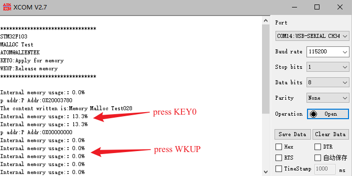

## MALLOC example<a name="catalogue"></a>


### 1 Brief
The function of this code is to press KEY0 to apply for memory and write content, 2K bytes of memory each time. The key WKUP is used to release the memory, only the memory applied last time can be released, and the memory management function can be tested through USMART debugging.
### 2 Hardware Hookup
The hardware resources used in this experiment are:
+ LED - PA8
+ USART1 - PA9\PA10
+ KEY - KEY0(PC13) 

This experiment uses the memory management library as a software library, so there is no corresponding connection schematic.

### 3 STM32CubeIDE Configuration


We copy the **11_USMART** project and name both the project and the.ioc file **18_MALLOC**.
The memory management library used in this experiment is a software library, which does not involve configuration on hardware and peripherals. So just add our user file ``malloc.c\malloc.h`` to the project.

##### code
###### malloc.h
```c#
/* mem1 memory parameter settings,mem1 is the SRAM inside the F103. */
#define MEM1_BLOCK_SIZE         32                              /* The memory block size is 32 bytes */
#define MEM1_MAX_SIZE           15 * 1024                       /* Maximum management memory 15K, F103 internal SRAM total 20KB */
#define MEM1_ALLOC_TABLE_SIZE   MEM1_MAX_SIZE/MEM1_BLOCK_SIZE   /* Memory table size */

/* If NULL is not defined, so define null */
#ifndef NULL
#define NULL 0
#endif

/* Memory management controller */
struct _m_mallco_dev
{
    void (*init)(uint8_t);                                      /* Initialize */
    uint16_t (*perused)(uint8_t);                               /* Memory usage */
    uint8_t *membase[SRAMBANK];                                 /* Memory pool Manages the memory for each area of SRAMBANK */
    MT_TYPE *memmap[SRAMBANK];                                  /* Memory management status table */
    uint8_t  memrdy[SRAMBANK];                                  /* Memory management ready */
};

extern struct _m_mallco_dev mallco_dev;                         /* Defines in mallco.c */
```
The program uses the macro definition **MEM1_BLOCK_SIZE** to define the total size of the internal memory pool that malloc can manage. **MEM1_ALLOC_TABLE_SIZE** represents the memory management table size of the memory pool. We can define multiple memory management tables so that we can manage multiple blocks of memory at the same time.

Through the memory management controller **_m_mallco_dev** struct, we store information about chunked memory management, its initialization function, access usage, memory pool, memory management table, and memory management status to achieve management control of the memory pool.

###### malloc.c
```c#
static uint32_t my_mem_malloc(uint8_t memx, uint32_t size)
{
    signed long offset = 0;
    uint32_t nmemb;     /* The number of memory blocks required */
    uint32_t cmemb = 0; /* Number of consecutive empty memory blocks */
    uint32_t i;

    if (!mallco_dev.memrdy[memx])
    {
        mallco_dev.init(memx);          /* If no initialization is performed, initialize the system first */
    }
    
    if (size == 0) return 0XFFFFFFFF;   /* No need for distribution */

    nmemb = size / memblksize[memx];    /* Gets the number of contiguous memory blocks to allocate */

    if (size % memblksize[memx]) nmemb++;

    for (offset = memtblsize[memx] - 1; offset >= 0; offset--)  /* Search the entire memory control area */
    {
        if (!mallco_dev.memmap[memx][offset])
        {
            cmemb++;            /* The number of consecutive empty memory blocks increases */
        }
        else 
        {
            cmemb = 0;          /* Continuous memory block clear */
        }
        
        if (cmemb == nmemb)     /* Consecutive nmemb empty memory blocks found */
        {
            for (i = 0; i < nmemb; i++) /* The memory block is not empty */
            {
                mallco_dev.memmap[memx][offset + i] = nmemb;
            }

            return (offset * memblksize[memx]); /* Return offset address */
        }
    }

    return 0XFFFFFFFF;  /* No memory block matching the allocation criteria was found */
}

static uint8_t my_mem_free(uint8_t memx, uint32_t offset)
{
    int i;

    if (!mallco_dev.memrdy[memx])   /* If no initialization is performed, initialize  first */
    {
        mallco_dev.init(memx);
        return 1;                   /* Uninitialized */
    }

    if (offset < memsize[memx])     /* The offset is in the memory pool. */
    {
        int index = offset / memblksize[memx];      /* Number of the memory block where the offset resides */
        int nmemb = mallco_dev.memmap[memx][index]; /* Memory block number */

        for (i = 0; i < nmemb; i++)                 /* Memory block cleared */
        {
            mallco_dev.memmap[memx][index + i] = 0;
        }

        return 0;
    }
    else
    {
        return 2;   /* Offset out of range. */
    }
}
```
The above code is used for memory allocation and memory dealing.These two functions are internal calls only, and the external calls include **mymalloc** and **myfree**.

###### usmart_config.c
To facilitate the verification of malloc-related functions, the **usmart_nametab** array is modified as follows.
```c#
struct _m_usmart_nametab usmart_nametab[] =
{
#if USMART_USE_WRFUNS == 1      /* If read and write operations are enabled */
    (void *)read_addr, "uint32_t read_addr(uint32_t addr)",
    (void *)write_addr, "void write_addr(uint32_t addr,uint32_t val)",
#endif
        
    (void *)mymalloc, "void *mymalloc(uint8_t memx, uint32_t size)",
    (void *)myfree, "void myfree(uint8_t memx, void *ptr)",
};
```
Functions related to MALLOC are added to USMART so that memory can be requested or freed directly via the serial port.

###### main.c
```c#
int main(void)
{
  /* USER CODE BEGIN 1 */
    uint8_t paddr[20];  /* Store the ASCII value of the P Addr:+p address */
    uint16_t memused = 0;
    uint8_t key;
    uint8_t i = 0;
    uint8_t *p = 0;
    uint8_t *tp = 0;

  /* USER CODE END 1 */

  /* MCU Configuration--------------------------------------------------------*/

  /* Reset of all peripherals, Initializes the Flash interface and the Systick. */
  HAL_Init();

  /* USER CODE BEGIN Init */

  /* USER CODE END Init */

  /* Configure the system clock */
  SystemClock_Config();

  /* USER CODE BEGIN SysInit */

  /* USER CODE END SysInit */

  /* Initialize all configured peripherals */
  MX_GPIO_Init();
  MX_USART1_UART_Init();
  MX_TIM2_Init();
  /* USER CODE BEGIN 2 */

  stm32f103c8t6_show_mesg();
  my_mem_init(SRAMIN);                		/* Initializes the internal SRAM memory pool */

  /* USER CODE END 2 */

  /* Infinite loop */
  /* USER CODE BEGIN WHILE */
  while (1)
  {
	  key = key_scan(0);      /* Connected press is not supported */

	  switch (key)
	  {
		  case KEY0_PRES:     /* KEY0 is pressed */
		  {
			 p = mymalloc(SRAMIN, 2048);  /* Apply 2K bytes and write the content to display above the lcd screen */

			  if (p != NULL)
			  {
				  sprintf((char *)p, "Memory Malloc Test%03d", i);        /* Write something to p */
			  }
			  break;
		  }

		  case WKUP_PRES:         /* KEY0 is pressed */
		  {
			  myfree(SRAMIN, p);  /* Release memory */
			  p = 0;              /* Pointing to null address */
			  break;
		  }
	  }

	  if (tp != p)
	  {
		  tp = p;
		  sprintf((char *)paddr, "P Addr:0X%08X", (uint32_t)tp);
		  printf("p addr:%s\r\n",paddr);

		  if (p)
		  {
              printf("The content written is:%s\r\n",p);              /* Displays the contents of P */
		  }
	  }

	  HAL_Delay(10);
	  i++;

	  if ((i % 20) == 0)
	  {
		  memused = my_mem_perused(SRAMIN);
		  sprintf((char *)paddr, "%d.%01d%%", memused / 10, memused % 10);
          printf("Internal memory usage:：%s\r\n",paddr);

		  LED_TOGGLE();  /* LED Blinks */
	  }

    /* USER CODE END WHILE */

    /* USER CODE BEGIN 3 */
  }
  /* USER CODE END 3 */
}
```


### 4 Running
#### 4.1 Compile & Download
After the compilation is complete, connect the DAP and the Mini Board, and then connect to the computer together to download the program to the development board.
#### 4.2 Phenomenon
Press the reset button to restart the development board, observe the LED flashing on the development board, open the serial port and the host computer ATK-XCOM can see the prompt information of the experiment, indicating that the code download is successful. We can press the **KEY0** button to apply for memory once, and then press the **WKUP** button to release the memory, as shown in the following figure:



[jump to tittle](#catalogue)
